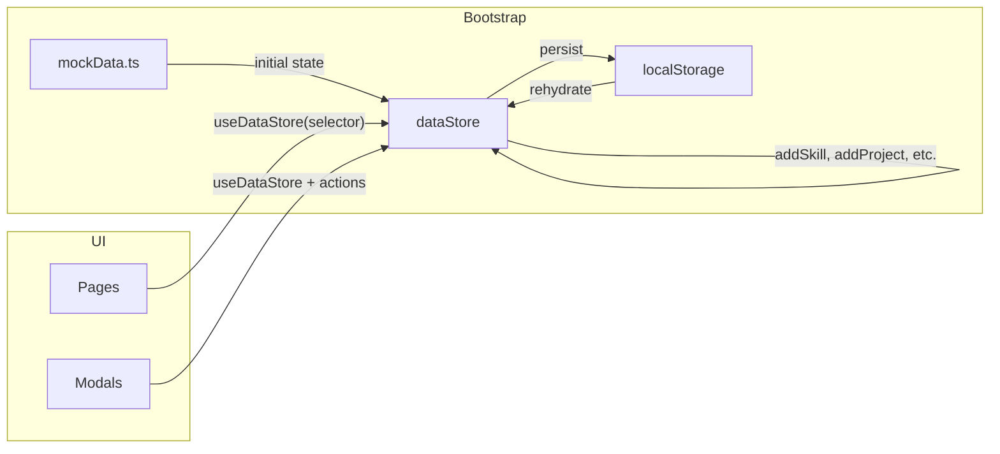

# Zustand + localStorage integration plan

## Scope

- **New:** One store file with state, persist middleware, and full CRUD actions; optionally an Edit Skill modal (or reuse AddSkillModal in edit mode) and Edit Project flow (reuse CreateProjectModal in edit mode).
- **Edit:** 8 pages + 2 modals (AddSkillModal, CreateProjectModal); wire Edit/Delete on [EmployeeSkills](src/app/pages/EmployeeSkills.tsx) and Edit/Delete on [ProjectMatching](src/app/pages/ProjectMatching.tsx); recompute chart data from skills/validations in the store. Types stay in [src/app/data/mockData.ts](src/app/data/mockData.ts); no change to [SkillBadge](src/app/components/SkillBadge.tsx) or [ValidationStatusBadge](src/app/components/ValidationStatusBadge.tsx) (types-only imports).
- **No change:** [main.tsx](src/main.tsx) (no provider needed for Zustand).
- **Full CRUD in scope:** Skills (add, update, delete); Validation requests (add, approve, reject); Projects (add, update, delete); Chart data (skillDistributionData, validationStatsData) recomputed from employeeSkills and validationRequests.

---

## 1. Store design

**File to create:** `src/app/store/dataStore.ts`

**State shape (all persisted):**

- `employeeSkills: Skill[]` — current user’s skills (CRUD).
- `validationRequests: ValidationRequest[]` — submit/approve/reject.
- `teamMembers: Employee[]` — read-only for now (list view).
- `skillCategories` — read-only taxonomy (from mockData).
- `projectSkillRequirements` — projects with required skills (add from CreateProjectModal).
- `skillDistributionData`, `departmentSkillData`, `validationStatsData` — chart data; **recomputed** from `employeeSkills` and `validationRequests` when those change (see section 10). Initial seed from mockData when store is first created.
- `learningRecommendations` — read-only for now.

**Persistence:** Use Zustand’s `persist` middleware:

- `name: 'skill-matrix-storage'`
- `storage: localStorage`
- `partialize` to persist only the slices you need (or persist full state).
- On first load (no localStorage key), initialize from mockData; otherwise rehydrate from localStorage.

**Actions:**

| Action                                             | Purpose                                                                                                                                                                                                                                                                               |
| -------------------------------------------------- | ------------------------------------------------------------------------------------------------------------------------------------------------------------------------------------------------------------------------------------------------------------------------------------- |
| `addSkill(skill: Skill)`                           | Append to `employeeSkills`, generate `id`. After update, call `recomputeChartData()`.                                                                                                                                                                                                 |
| `updateSkill(id: string, updates: Partial<Skill>)` | Find by `id` in `employeeSkills`, merge updates. After update, call `recomputeChartData()`.                                                                                                                                                                                           |
| `deleteSkill(id: string)`                          | Filter out from `employeeSkills`. After update, call `recomputeChartData()`.                                                                                                                                                                                                          |
| `addValidationRequest(request: ValidationRequest)` | Append to `validationRequests`. After update, call `recomputeChartData()`.                                                                                                                                                                                                            |
| `updateValidationRequest(id: string, updates)`     | Approve/reject: update or remove request, optionally sync skill in `employeeSkills`. After update, call `recomputeChartData()`.                                                                                                                                                       |
| `addProject(projectData)`                          | Map form payload to store shape, append to `projectSkillRequirements`.                                                                                                                                                                                                                |
| `updateProject(id: string, projectData)`           | Find project by `id`, merge updates (projectName, requiredSkills).                                                                                                                                                                                                                    |
| `deleteProject(id: string)`                        | Remove project from `projectSkillRequirements`.                                                                                                                                                                                                                                       |
| `recomputeChartData()`                             | Derive `skillDistributionData` from `employeeSkills` (count by skill name + proficiency); derive `validationStatsData` from `employeeSkills` and `validationRequests` (count by status). Optionally keep `departmentSkillData` static or derive if team/department data is available. |

**Imports:** In the store, import types and initial data from [src/app/data/mockData.ts](src/app/data/mockData.ts) (e.g. `employeeSkills`, `validationRequests`, `teamMembers`, `skillCategories`, `projectSkillRequirements`, `skillDistributionData`, `departmentSkillData`, `validationStatsData`, `learningRecommendations`). Use these as the default state when there is no persisted state.

---

## 2. Data flow

- Components read via `useDataStore(state => state.employeeSkills)` (or the slice they need).
- Components that perform CRUD call `useDataStore.getState().addSkill(...)` or receive an action passed from the parent.

---

## 3. File-by-file changes

### 3.1 New file: `src/app/store/dataStore.ts`

- Create Zustand store with `create<DataState & DataActions>()(...)`.
- Add `persist(store, { name: 'skill-matrix-storage', storage: localStorage })` (or use `persist` from `zustand/middleware` with `create`).
- Define state keys and action functions as above; inside actions, use `getState().employeeSkills` / `setState({ employeeSkills: [...] })` (or the equivalent pattern with a single `set`/`setState`).
- Export `useDataStore` (and optionally selectors like `useEmployeeSkills` if you prefer).

### 3.2 Pages (replace mockData imports with store)

| File                                                             | Current import                                 | Change                                                                                                                                                                                                                                                                                                                                                  |
| ---------------------------------------------------------------- | ---------------------------------------------- | ------------------------------------------------------------------------------------------------------------------------------------------------------------------------------------------------------------------------------------------------------------------------------------------------------------------------------------------------------- |
| [EmployeeSkills.tsx](src/app/pages/EmployeeSkills.tsx)           | `employeeSkills` from mockData                 | `const employeeSkills = useDataStore(s => s.employeeSkills);` plus wire Edit button (reuse AddSkillModal with initialSkill → updateSkill), Delete button (confirm → deleteSkill), Submit for Validation (addValidationRequest + updateSkill status).                                                                                                    |
| [TeamSkills.tsx](src/app/pages/TeamSkills.tsx)                   | `teamMembers`, `skillDistributionData`         | Read both from store via selectors.                                                                                                                                                                                                                                                                                                                     |
| [ProjectMatching.tsx](src/app/pages/ProjectMatching.tsx)         | `teamMembers`, `projectSkillRequirements`      | Read from store; handleCreateProject calls addProject. Add Edit/Delete per project: Edit opens CreateProjectModal with initialProject → updateProject(id, data); Delete: confirm → deleteProject(id). selectedProject from store.                                                                                                                       |
| [LearningDevelopment.tsx](src/app/pages/LearningDevelopment.tsx) | `learningRecommendations`                      | Read from store.                                                                                                                                                                                                                                                                                                                                        |
| [Dashboard.tsx](src/app/pages/Dashboard.tsx)                     | `skillDistributionData`, `validationStatsData` | Read from store.                                                                                                                                                                                                                                                                                                                                        |
| [SkillAnalytics.tsx](src/app/pages/SkillAnalytics.tsx)           | `departmentSkillData`                          | Read from store.                                                                                                                                                                                                                                                                                                                                        |
| [SkillValidation.tsx](src/app/pages/SkillValidation.tsx)         | `validationRequests`, `ProficiencyLevel`       | Keep `ProficiencyLevel` from mockData (type). Read `validationRequests` from store. Wire “Approve & Validate” / “Reject” to store actions (e.g. `approveRequest(id, adjustedLevel, feedback)`, `rejectRequest(id, feedback)`). Ensure first request exists for initial `selectedRequest` (e.g. `validationRequests[0]` or null and handle empty state). |
| [SkillTaxonomy.tsx](src/app/pages/SkillTaxonomy.tsx)             | `skillCategories`                              | Read from store.                                                                                                                                                                                                                                                                                                                                        |

### 3.3 Modals

- **[AddSkillModal.tsx](src/app/components/AddSkillModal.tsx):** Keep importing `skillCategories` and `ProficiencyLevel` from mockData (or read `skillCategories` from store for consistency). On “Submit for Validation” click: build `Skill` object (with `validationStatus: 'Pending validation'`), call `addSkill` from store, then `onClose()`. Generate `id` in the modal or in the store’s `addSkill`.
- **[CreateProjectModal.tsx](src/app/components/CreateProjectModal.tsx):** Add optional `initialProject` prop for edit mode (pre-fill projectName and skillRequirements). When present, submit calls parent’s `onSubmit` with same shape so parent can call `updateProject(initialProject.id, data)`. When absent, parent passes `onSubmit` that calls `addProject(data)`.

### 3.4 Unchanged

- [SkillBadge.tsx](src/app/components/SkillBadge.tsx), [ValidationStatusBadge.tsx](src/app/components/ValidationStatusBadge.tsx): keep importing only types from mockData.
- [main.tsx](src/main.tsx): no provider; store is used directly.

---

## 4. Validation request flow (SkillValidation)

- **Approve:** Call store action with request id, adjusted proficiency, and feedback. Action: update the request’s status (e.g. mark as resolved or remove from list), and optionally update the matching skill in `employeeSkills` (e.g. set `proficiencyLevel`, `validationStatus: 'Validated'`).
- **Reject:** Call store action with id and feedback; update request status or remove from list, optionally set skill’s `validationStatus: 'Rejected'` in `employeeSkills` if you keep that field.
- After approve/reject, `selectedRequest` can be set to the next request in the list or cleared; list comes from store so it updates automatically.

---

## 5. Project create flow (ProjectMatching)

- In [ProjectMatching.tsx](src/app/pages/ProjectMatching.tsx), replace the current `handleCreateProject` (lines 26–29) with a call to the store’s `addProject(projectData)`.
- Map `projectData` from [CreateProjectModal](src/app/components/CreateProjectModal.tsx) (projectName, skillRequirements array, etc.) into the shape expected by [mockData](src/app/data/mockData.ts) `projectSkillRequirements` (e.g. `id`, `projectName`, `requiredSkills` with `name`, `level`, `count`). Do this mapping either inside `addProject` in the store or in the parent before calling `addProject`.

---

## 6. Order of implementation

1. Run `npm install zustand` (you do this).
2. Add `src/app/store/dataStore.ts`: state, persist, and actions (addSkill, updateSkill, deleteSkill, addValidationRequest, updateValidationRequest, addProject). Seed from mockData when no persisted state.
3. Switch all 8 pages to read from the store (remove mockData data imports, add `useDataStore` selectors).
4. Wire [AddSkillModal](src/app/components/AddSkillModal.tsx): on submit call `addSkill` then `onClose`.
5. Wire [ProjectMatching](src/app/pages/ProjectMatching.tsx) and [CreateProjectModal](src/app/components/CreateProjectModal.tsx): parent passes `onSubmit` that calls `addProject` with mapped payload.
6. Wire [SkillValidation](src/app/pages/SkillValidation.tsx): approve/reject buttons call store actions; handle empty `validationRequests` for initial selection.
7. **Edit/Delete skill:** On [EmployeeSkills](src/app/pages/EmployeeSkills.tsx), wire Edit button to open an edit flow (modal or inline) and call `updateSkill`; wire Delete to confirm dialog then `deleteSkill`. Optionally add EditSkillModal (or reuse AddSkillModal with `initialSkill` prop).
8. **Edit/Delete project:** On [ProjectMatching](src/app/pages/ProjectMatching.tsx), add Edit/Delete buttons per project card or in the selected-project panel. Edit: open CreateProjectModal with initial data and `onSubmit` that calls `updateProject(id, data)`. Delete: confirm then `deleteProject(id)`. Add `updateProject` and `deleteProject` in the store.
9. **Recomputed charts:** In store, implement `recomputeChartData()` that sets `skillDistributionData` (from counts in `employeeSkills` by skill name and proficiency) and `validationStatsData` (from counts in `employeeSkills` + `validationRequests` by status). Call it from `addSkill`, `updateSkill`, `deleteSkill`, `addValidationRequest`, `updateValidationRequest`.
10. Smoke-test: add/edit/delete skill, create/edit/delete project, approve/reject validation, refresh and confirm persistence; confirm Dashboard and SkillAnalytics charts update after skill/validation changes.

---

## 8. Edit and delete skill (EmployeeSkills)

- **Edit:** The existing "Edit" button (line ~173 in [EmployeeSkills.tsx](src/app/pages/EmployeeSkills.tsx)) opens an edit flow. Reuse [AddSkillModal](src/app/components/AddSkillModal.tsx) with an optional `initialSkill` prop: when set, modal pre-fills and on submit calls `updateSkill(initialSkill.id, values)` instead of `addSkill`. On save, call store’s `updateSkill(skill.id, updates)` and close.
- **Delete:** Add a "Delete" button per skill card. On click, show confirmation (e.g. `window.confirm` or AlertDialog). On confirm, call store’s `deleteSkill(skill.id)`.
- **Submit for Validation:** When user clicks "Submit for Validation" on a self-assessed skill, create a `ValidationRequest` (use fixed current-user id/name for now) and call `addValidationRequest`; optionally call `updateSkill(skill.id, { validationStatus: 'Pending validation' })`.

---

## 9. Edit and delete project (ProjectMatching)

- **Store actions:** Implement `updateProject(id: string, data)` (find project by id, merge `projectName` and `requiredSkills`) and `deleteProject(id: string)` (filter out from `projectSkillRequirements`).
- **UI:** Add "Edit" and "Delete" on each project card or in the selected-project detail panel.
  - **Edit:** Open [CreateProjectModal](src/app/components/CreateProjectModal.tsx) with `initialProject={selectedProject}` (add prop to modal). Submit calls `updateProject(selectedProject.id, data)`. Map form data to same shape as add (requiredSkills: name, level, count).
  - **Delete:** Confirm then call `deleteProject(project.id)`. If deleted project was `selectedProject`, set to first remaining project or null.
- Initialize `selectedProject` from store (e.g. `projectSkillRequirements[0]` when list is non-empty).

---

## 10. Recomputed chart data

- **skillDistributionData:** From `employeeSkills`: group by `skill.name`, count by `proficiencyLevel` (beginner, intermediate, advanced, expert). Shape: `{ skill: string, beginner: number, intermediate: number, advanced: number, expert: number }[]`.
- **validationStatsData:** From `employeeSkills` (and resolved validation requests): count by `validationStatus` (Validated, Pending, Self-assessed, Rejected). Shape: `{ name: string, value: number, color: string }[]` with fixed colors per status.
- **departmentSkillData:** Keep static (initial from mockData); no department on skills in current model.
- Call `recomputeChartData()` at end of `addSkill`, `updateSkill`, `deleteSkill`, `addValidationRequest`, `updateValidationRequest`. Implement as a store action that reads `employeeSkills`/`validationRequests`, computes both arrays, and `setState({ skillDistributionData, validationStatsData })`.

---

## 11. Optional / future (out of scope)

- **departmentSkillData:** Recompute only if you add department to skills or aggregate from `teamMembers`.
- **learningRecommendations:** Leave read-only; can later derive from skill gaps.

